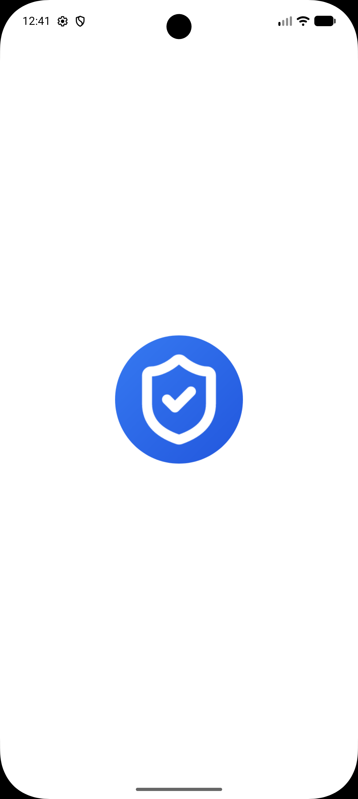

# Telegram Drive

**Telegram Drive** is an open-source, cross-platform desktop application that turns
your Telegram account into an unlimited, secure cloud storage drive. Built with
**Tauri**, **Rust**, and **React**.

<div align="center">

[](LICENSE)
[]()
[](https://github.com/code-by-RJ)

</div>


## What is Telegram Drive?

Telegram Drive leverages the Telegram API to allow you to upload, organize, and manage files directly on Telegram's servers. It treats your "Saved Messages" and created Channels as folders, giving you a familiar file explorer interface for your Telegram cloud.

### Key Features

*   **Unlimited Cloud Storage**: Utilizing Telegram's generous cloud infrastructure.
*   **High Performance Grid**: Virtual scrolling handles folders with thousands of files instantly.
*   **Media Streaming**: Stream video and audio files directly without downloading.
*   **PDF Viewer:** Built-in PDF support with infinite scrolling for seamless document reading.
*   **Drag & Drop**: Intuitive drag-and-drop upload and file management.
*   **Thumbnail Previews**: Inline thumbnails for images and media files.
*   **Folder Management**: Create "Folders" (private Telegram Channels) to organize content.
*   **Shareable Links**: Generate direct download links with optional password protection and expiration, and revoke access anytime from the dashboard.
*   **REST API for AI Integration**: Secure local API (off by default) with configurable port and API key auth.
*   **Proxy Support**: Native integration for SOCKS5 and MTProto proxies.
*   **VPN Optimizer**: Aggressive network tuning including bandwidth throttling, adjustable transfer chunk sizing, and adaptive keep-alives.
*   **Privacy Focused**: API keys and data stay local. No third-party servers. No ads.
*   **Cross-Platform**: Native apps for macOS (Intel/ARM), Windows, Linux and Android.

---

## Screenshots

### Desktop App

| Dashboard | File Preview |
|-----------|--------------|
|  |  |

| Grid View | Authentication |
|-----------|----------------|
|  |  |

| Audio Playback | Video Playback |
|----------------|----------------|
|  |  |

| Auth Code Screen | Upload Example |
|------------------|-------------|
|  |  |

| Folder Creation | Folder List View |
|-----------------|------------------|
|  |  |

### Android App

| Home Screen | Splash Screen | Dark Mode Folder View |
|-------------|---------------|-----------------------|
|  |  |  |

---

## Tech Stack

*   **Frontend**: React, TypeScript, TailwindCSS, Framer Motion
*   **Backend**: Rust (Tauri), Grammers (Telegram Client)
*   **Build Tool**: Vite

---

## Getting Started

### Prerequisites

*   **Node.js (v18+)**: [Download here](https://nodejs.org/)
*   **Rust (latest stable)**: Install via [rustup](https://rustup.rs/):
    *   **macOS/Linux:** `curl --proto '=https' --tlsv1.2 -sSf https://sh.rustup.rs | sh`
    *   **Windows:** Download and run `rustup-init.exe` from [rustup.rs](https://rustup.rs/)
*   **OS-Specific Build Tools**:
    *   **macOS:** `xcode-select --install`
    *   **Linux:** `sudo apt update && sudo apt install libwebkit2gtk-4.1-dev build-essential curl wget file libxdo-dev libssl-dev libayatana-appindicator3-dev librsvg2-dev`
    *   **Windows:** Install [Visual Studio Build Tools](https://visualstudio.microsoft.com/visual-cpp-build-tools/) with "Desktop development with C++" workload.
*   **Telegram API Credentials**:
    1. Log into [my.telegram.org](https://my.telegram.org)
    2. Go to "API development tools" and create a new application to get your `api_id` and `api_hash`

> [!NOTE]
> **First-run Compile Time:** The initial build will take **5 to 15 minutes** depending on your hardware. Subsequent builds will be much faster.

### Installation

1.  **Clone the repository**
    ```bash
    git clone https://github.com/code-by-RJ/telegram-drive.git
    cd telegram-drive
    ```

2.  **Install Dependencies**
    ```bash
    cd app
    npm install
    ```

3.  **Run in Development Mode**
    ```bash
    npm run tauri dev
    ```

4.  **Build**
    ```bash
    npm run tauri build -- --bundles app,dmg
    ```

---

## Open Source & License

This project is **Free and Open Source Software**. Licensed under the **MIT License**.

Built with ❤️ by [RJ](https://github.com/code-by-RJ)

---

*Disclaimer: This application is not affiliated with Telegram FZ-LLC. Use responsibly and in accordance with Telegram's Terms of Service.*# Telegram-Drive
